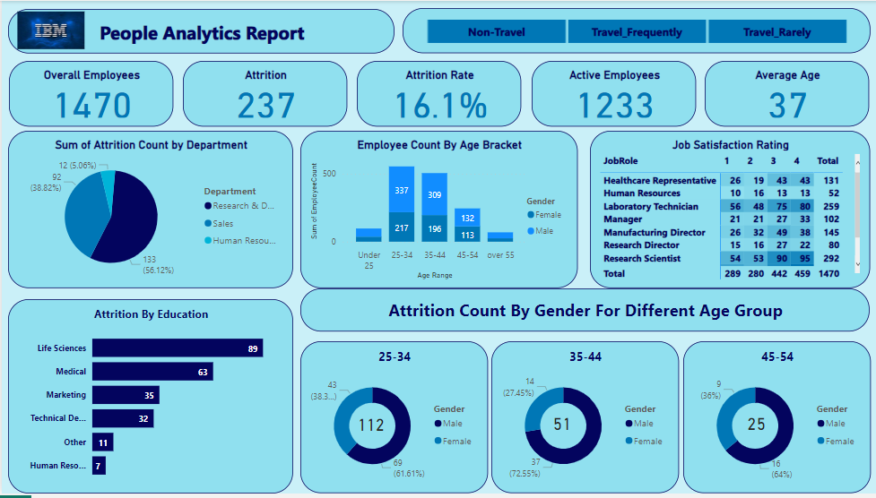

# HR Analytics Dashboard using PowerBI

Welcome to the HR Analytics Dashboard project repository! This project is focused on analyzing Human Resources data obtained from Kaggle, specifically the dataset provided by IBM Data Scientists. The project utilizes PowerBI for data visualization and analysis, highlighting various HR metrics and insights. The dashboard showcases Attrition metrics across different dimensions as well as Job Satisfaction ratings across different professions and age groups.
Table of Contents

    Project Overview
    Dataset
    Key Metrics Explored
    Visualization
    Dashboard Interactivity
    Getting Started
    Usage
    Contributing
    License

Project Overview

In this project, we've delved into HR analytics using the powerful data visualization tool, PowerBI. We've extracted valuable insights from the dataset provided by IBM Data Scientists, which contains information related to employee attrition, gender, departments, educational qualifications, job satisfaction, and age groups.
Dataset

The dataset used for this project was obtained from Kaggle and is provided by IBM Data Scientists. It encompasses a range of HR-related information, allowing us to perform a comprehensive analysis of employee attrition and job satisfaction factors.
Key Metrics Explored

    Attrition Count
    Attrition Rate
    Attrition Rate across Gender
    Attrition Rate across Departments
    Attrition Rate based on Educational Qualification
    Job Satisfaction Ratings across Professions
    Job Satisfaction Ratings across Age Groups

Visualization

The visualization was accomplished using PowerBI's versatile tools, allowing for clear and insightful representations of the key HR metrics. The dashboard showcases these metrics through various charts, graphs, and card visuals, all of which provide an at-a-glance view of the data trends.

Dashboard Interactivity

The dashboard has been designed with interactivity in mind. Users can filter and slice the data to gain deeper insights by interacting with the visual elements. The dashboard provides a user-friendly experience to explore the HR analytics data from different angles.

Getting Started

To explore the HR Analytics Dashboard, follow these steps:

    Clone this repository to your local machine.
    Open PowerBI Desktop and connect to the dataset.
    Utilize the DAX measures to recreate the visualizations.
    Customize the dashboard as per your requirements.
    Publish the dashboard to PowerBI Service using your MS 365 developer account.
    Share the published dashboard link with others to enable interactive exploration.

Usage

Feel free to adapt, modify, or enhance the dashboard to suit your specific needs. You can also use this project as a template for creating your own HR analytics dashboards.
Contributing

Contributions are welcome! If you find any issues or have ideas to enhance the dashboard, please open an issue or submit a pull request. Let's collaborate to make this project even better.
License

This project is licensed under the MIT License.

Placeholder Section:

Below are placeholders where you can add more specific details about the project, such as images of the dashboard, code snippets, and additional documentation. Feel free to enrich the README with actual content from your project.
Dashboard Screenshots

Placeholder: Add Dashboard Screenshots
DAX Measures

DAX

// Placeholder: Add DAX Measures used in the project

Project Structure

plaintext

├── data/
│   ├── dataset.csv
│   └── ...
├── visuals/
│   ├── screenshot1.png
│   └── ...
├── scripts/
│   ├── preprocessing.py
│   └── ...
├── notebooks/
│   ├── analysis.ipynb
│   └── ...
├── LICENSE
└── README.md

Additional Resources

    Kaggle Dataset Link
    PowerBI Documentation
    MS 365 Developer Account

Enjoy exploring and analyzing the HR data using the PowerBI dashboard! If you have any questions, don't hesitate to reach out.

Note: Replace the placeholders with actual content and links as needed.
